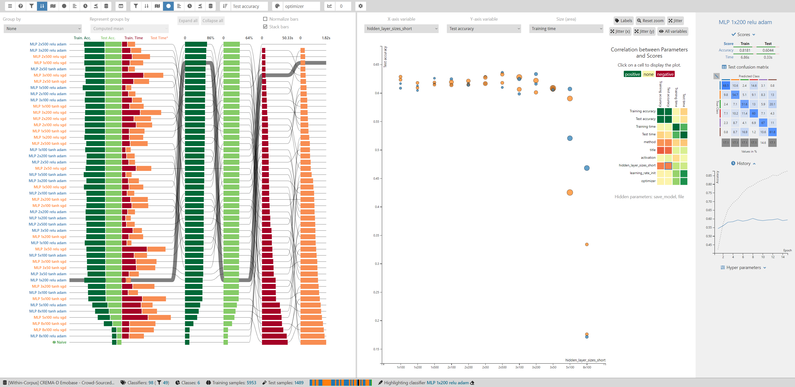
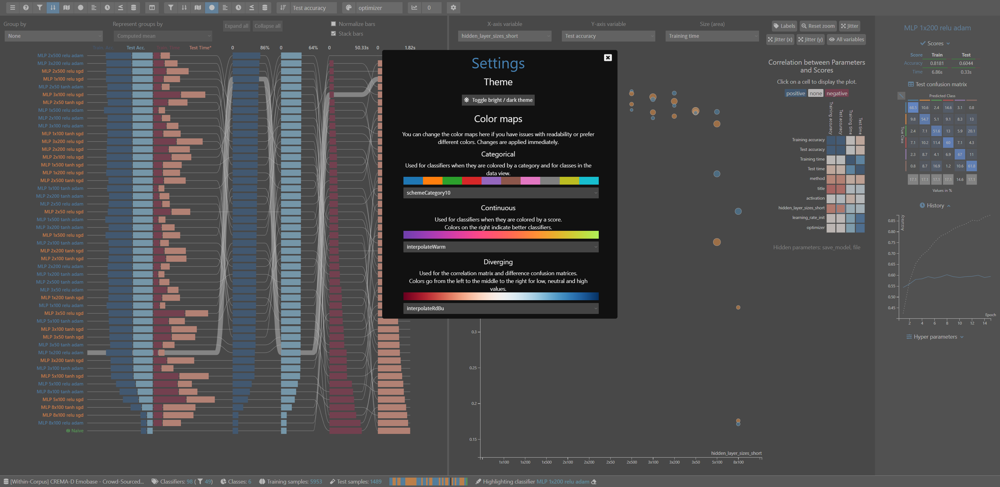

# ClaVis: An Interactive Visual Comparison System for Classifiers

[Link to the Paper](https://dl.acm.org/doi/10.1145/3399715.3399814)

[Here is a short tutorial](./docs/tutorial.md) for the complete setup and usage workflow.

[Here is the full user documentation](./docs/getting_started.md).

## How to Cite

```
@inproceedings{10.1145/3399715.3399814,
author = {Heyen, Frank and Munz, Tanja and Neumann, Michael and Ortega, Daniel and Vu, Ngoc Thang and Weiskopf, Daniel and Sedlmair, Michael},
title = {ClaVis: An Interactive Visual Comparison System for Classifiers},
year = {2020},
isbn = {9781450375351},
publisher = {Association for Computing Machinery},
address = {New York, NY, USA},
url = {https://doi.org/10.1145/3399715.3399814},
doi = {10.1145/3399715.3399814},
abstract = {We propose ClaVis, a visual analytics system for comparative analysis of classification models. ClaVis allows users to visually compare the performance and behavior of tens to hundreds of classifiers trained with different hyperparameter configurations. Our approach is plugin-based and classifier-agnostic and allows users to add their own datasets and classifier implementations. It provides multiple visualizations, including a multivariate ranking, a similarity map, a scatterplot that reveals correlations between parameters and scores, and a training history chart. We demonstrate the effectivity of our approach in multiple case studies for training classification models in the domain of natural language processing.},
booktitle = {Proceedings of the International Conference on Advanced Visual Interfaces},
articleno = {9},
numpages = {9},
keywords = {visual analytics, machine learning, classifier comparison, Visualization},
location = {Salerno, Italy},
series = {AVI '20}
}
```

## Screenshots




