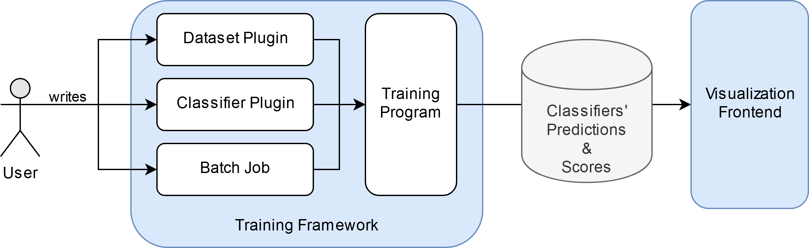

# Backend Documentation

1. [Backend Documentation](#backend-documentation)
   1. [How to get Started](#how-to-get-started)
   2. [A simple Example](#a-simple-example)
      1. [The Workflow](#the-workflow)
      2. [The Structure of the Backend](#the-structure-of-the-backend)
      3. [The Dataset](#the-dataset)
      4. [The Classifier](#the-classifier)
         1. [Parameter Specification](#parameter-specification)
         2. [Classifier Implementation](#classifier-implementation)
         3. [A More Complex Example](#a-more-complex-example)
      5. [The Batch Job](#the-batch-job)
      6. [The Training](#the-training)
      7. [The Analysis](#the-analysis)
   3. [Dataset Plugins](#dataset-plugins)
      1. [The Basics](#the-basics)
      2. [Data Formats](#data-formats)
      3. [Passing Data Specifications to Classifiers](#passing-data-specifications-to-classifiers)
      4. [Multi-label Classification](#multi-label-classification)
      5. [Cross Validation](#cross-validation)
         1. [Cross Validation on the Whole Dataset](#cross-validation-on-the-whole-dataset)
         2. [Cross Validation by Training on the Training Set and Testing on Separate Test Set Splits](#cross-validation-by-training-on-the-training-set-and-testing-on-separate-test-set-splits)
      6. [Cross-corpus and Multi-corpus](#cross-corpus-and-multi-corpus)
   4. [Classifier Plugins](#classifier-plugins)
      1. [The Basics](#the-basics-1)
      2. [Data Formats](#data-formats-1)
      3. [Re-shaping the Data to the Original Shape](#re-shaping-the-data-to-the-original-shape)
      4. [Returning a Training History (Keras)](#returning-a-training-history-keras)
      5. [Saving and Loading Model Weights (Keras)](#saving-and-loading-model-weights-keras)
   5. [Creating and Running Batch Jobs](#creating-and-running-batch-jobs)
      1. [Configuration](#configuration)
      2. [Projection Configuration](#projection-configuration)
      3. [Classifier Configuration](#classifier-configuration)
      4. [Meta Configurations](#meta-configurations)
   6. [Reference Classifiers](#reference-classifiers)
      1. [Cross Validation Options](#cross-validation-options)
   7. [Other Features](#other-features)
      1. [Auto-tuning of Parameters (Experimental)](#auto-tuning-of-parameters-experimental)
      2. [Cache Explorer](#cache-explorer)
      3. [Tips and Tricks](#tips-and-tricks)
      4. [Troubleshooting](#troubleshooting)

## How to get Started

Before you implement your own plugins, I would recommend to first follow the [tutorial](./tutorial.md) to get the full system up and running.
You can try to run some example jobs and see what they do.
Once you implemented a plugin you also need at least the backend to work for testing it.

I recommend starting with your dataset and testing it with the existing classifier plugins.
Random forests and MLPs are fast and should work fine with any data that respects the required format.

You can also look at or copy code from existing plugins in the backend in `modules/datasets/` and `modules/classifiers/`.

## A simple Example

If you have not done this yet, clone all repositories into the same parent directory.

After setting up the system (see the [tutorial](./tutorial.md)), you may be overwhelmed and not know how to start.
In this section we are going to create a simple example to show the whole workflow.
For more advanced features you can reference the rest of this documentation.

### The Workflow



### The Structure of the Backend

The backend is structure as follows:
- `cache/` this is where the results and scores of trained classifiers are stored
- `jobs/` this directory contains batch jobs, which are used to train classifiers (more on that later)
- `modules/` this contains modules of the system and two directories for plugins:
  - `datasets/` here we add our dataset plugins
  - `classifiers/` here we add our classifier plugins
  - You do not need to care about the remaining files here...
- `autotune.py` auto-tuner (see [Auto-tuning of Parameters (Experimental)](#Auto-tuning-of-Parameters-Experimental))
- `batch.py` this is used to run batch jobs
- `explorer.py` this is a small command line interface to show what data is inside the `cache/` and remove files that you do not need (this can also be done more easily from the frontend)
- `main.py` this is a small API server that is needed to give the frontend access to the `cache/`

### The Dataset

To add a new dataset, create a new directory in `modules/datasets/` and add an `__init__.py` file.
Or simply copy-paste an existing plugin.

A dataset plugin consists of two functions:
- `get_info`
  - Returns a dictionary with the plugin name, a description and the class names
- `get_data`
  - Returns the data as a dictionary with numpy arrays
  - It gets passed the absolute path of `modules/datasets/` so you can access files that you saved in the plugin's directory

```python
from sklearn import datasets
import numpy as np

def get_info():
    return {
        'name': 'sklearn_iris',
        'description': 'ScikitLearn | Iris',
        'class_names': ['Iris Setosa', 'Iris Versicolor', 'Iris Virginica']
    }

def get_data(datasets_path):
    data = datasets.load_iris()

    return {
        'X_train': np.array(data.data),
        'y_train': np.array(data.target),
        'X_test': np.array([]),
        'y_test': np.array([]),
        'class_names': ['Iris Setosa', 'Iris Versicolor', 'Iris Virginica']
    }
```

To be compatibly with any kind of classifier, the data has to have this shape:
- X_train, X_test: `(num_samples, num_features)` (with only numbers inside!)
- y_train, y_test: `(num_samples,)` (with class labels as 0, 1, 2, ...)
This means for example that images have to be flattened.
See [Passing Data Specifications to Classifiers](#Passing-Data-Specifications-to-Classifiers) for more details on how to work with such data.

### The Classifier

To add a new classifier, create a new directory in `modules/classifiers/` and add an `__init__.py` file.
Or simply copy-paste an existing plugin.
Classifier plugins are a bit more complex, so let's first see a really simple example with a k-nearest neighbor classifier.

```python
from sklearn.neighbors import KNeighborsClassifier
from ...tools import check_argument as check

# See 'Parameter Specification' below
CLF_INFO = {
    'name': 'kneighbors',
    'short': 'KNN',
    'description': 'k Nearest Neighbors Classifier',
    'parameters': [
        {
            'name': 'n_neighbors',
            'description': 'Number of neighbors',
            'type': 'integer',
            'range': [1, 1000],
            'default_value': 5
        }
    ]
}

# Those two functions are not important for now
def get_clf(args, data_specs):
    return Classifier(args, data_specs)

def get_info():
    return CLF_INFO

# See 'Classifier Implementation' below
class Classifier():
    def __init__(self, args, data_specs):
        n_neighbors = check('n_neighbors', args, CLF_INFO)
        self.clf = KNeighborsClassifier(n_neighbors=n_neighbors, n_jobs=-1)

    def get_info(self):
        return CLF_INFO

    def fit(self, X_train, y_train):
        return self.clf.fit(X_train, y_train)

    def predict(self, X_test, y_test):
        return self.clf.predict(X_test)

    def predict_proba(self, X_test, y_test):
        return self.clf.predict_proba(X_test)
```

#### Parameter Specification

The first part of the plugin is the parameter specification in `CLF_INFO`.
Here we specify the name of our plugin and a description.
We also tell the system what parameters our classifier supports, what type and range they have and what the default value is.
This information is used in the `__init__` function of the classifier, where we will use `tools.check_argument` to check all parameter values to make sure they are valid.
If not, `tools.check_argument` will warn us during training and take the default value automatically.

#### Classifier Implementation

The classifier itself is implemented as a class with at least 5 functions.
- `__init__`
  - This function is passed all parameters and their values as a dictionary in `args`
  - It may also be passed some additional data from the dataset plugin in `data_specs` (see [Passing Data Specifications to Classifiers](#Passing-Data-Specifications-to-Classifiers))
  - Here we read and check parameters and initialize the classifier.
- `get_info`
  - Boilerplate, simply leave it as is
- `fit`
  - This function is passed the training data and labels, train your classifier here
- `precict` and `predict_proba`
  - Those functions are passed the test data and labels and should return the classifier's predictions and predicted probabilities for each sample.

#### A More Complex Example

This is an example for a simple Multi-layer Perceptron, you can see the full code in `/modules/classifers/mlpc_keras`.
It shows examples for all types of parameters (integer, float, string, boolean).
Here we also return a training history.

```python
from keras.models import Sequential
from keras.layers import Dropout, Dense, Activation
from keras import optimizers
from ...tools import check_argument as check

CLF_INFO = {
    'name': 'mlpc_keras',
    'short': 'MLPC (k)',
    'description': 'Multi-layer Perceptron (Keras)',
    'parameters': [
        {
            # Example for a string parameter
            'name': 'activation',
            'description': 'Activation function',
            'type': 'string',
            'range': ['relu', 'tanh', 'sigmoid', 'linear'],
            'default_value': 'relu'
        },
        {
            'name': 'optimizer',
            'description': 'Optimizer',
            'type': 'string',
            'range': ['sgd', 'adadelta', 'adam'],
            'default_value': 'adam'
        },
        {
            # Example for a float parameter
            'name': 'learning_rate_init',
            'description': 'Initial learning rate',
            'type': 'float',
            'range': [0, 1],
            'default_value': 0.001
        },
        {
            'name': 'dropout',
            'description': 'Dropout',
            'type': 'float',
            'range': [0, 1],
            'default_value': 0.5
        },
        {
            # Example for an integer parameter
            'name': 'batch_size',
            'description': 'Batch size',
            'type': 'integer',
            'range': [1, 512],
            'default_value': 64
        },
        {
            'name': 'epochs',
            'description': 'Epochs',
            'type': 'integer',
            'range': [0, 10000],
            'default_value': 50
        },
        {
            # Example for a boolean parameter
            'name': 'early_stopping',
            'description': 'Early stopping',
            'type': 'boolean',
            'default_value': False
        }
    ]
}

def get_clf(args, data_specs):
    return Classifier(args, data_specs)

def get_info():
    return CLF_INFO

class Classifier():
    def __init__(self, args, data_specs):
        # Check and save parameters
        self.optimizer = check('optimizer', args, CLF_INFO)
        self.activation = check('activation', args, CLF_INFO)
        self.learning_rate_init = check('learning_rate_init', args, CLF_INFO)
        self.dropout = check('dropout', args, CLF_INFO)
        self.batch_size = check('batch_size', args, CLF_INFO)
        self.epochs = check('epochs', args, CLF_INFO)
        self.early_stopping = check('early_stopping', args, CLF_INFO)
        # There is also some other information you may use
        self.title = args['title']
        self.job_title = data_specs['job_title']
        self.dataset_name = data_specs['dataset_name']
        self.num_classes = data_specs['num_classes']

    def get_info(self):
        return CLF_INFO

    def fit(self, X_train, y_train):
        # Create optimizer based on argument and initial learning rate
        # You can add more options!
        if self.optimizer == 'sgd':
            opt = optimizers.SGD(lr=self.learning_rate_init)
        if self.optimizer == 'adadelta':
            opt = optimizers.Adadelta(lr=self.learning_rate_init)
        if self.optimizer == 'adam':
            opt = optimizers.Adam(lr=self.learning_rate_init)
        # Network architecture
        model = Sequential()
        model.add(Dense(self.hidden_layer_sizes[0],
                        activation=self.activation,
                        input_dim=X_train.shape[1]))
        model.add(Dropout(self.dropout))
        model.add(Dense(layer_size, activation=self.activation))
        model.add(Dropout(self.dropout))
        model.add(Dense(layer_size, activation=self.activation))
        model.add(Dropout(self.dropout))
        model.add(Dense(layer_size, activation=self.activation))
        model.add(Dropout(self.dropout))
        model.add(Dense(self.num_classes, activation='softmax'))
        model.compile(loss='sparse_categorical_crossentropy',
                      optimizer=opt,
                      metrics=['accuracy'])
        # Early stopping
        callbacks = None
        if self.early_stopping:
            early_stopping = EarlyStopping(monitor='val_loss',
                                           patience=10,
                                           restore_best_weights=True,
                                           verbose=2)
            callbacks = [early_stopping]
        # Train network (and save training history)
        self.clf = model
        self.history = model.fit(X_train,
                                 y_train,
                                 batch_size=self.batch_size,
                                 epochs=self.epochs,
                                 verbose=1,
                                 validation_split=0.2,
                                 callbacks=callbacks)

    def predict(self, X_test, y_test):
        return self.clf.predict_classes(X_test)

    def predict_proba(self, X_test, y_test):
        return self.clf.predict_proba(X_test)

    # Here we also return a training history!
    def get_history(self):
        return self.history.history
```

### The Batch Job

Now we can create a batch job!
Simply create a new `my_job.json` file in `jobs/` or copy-paste an existing one.

```javascript
{
    "data": {
        // You probably want to change the next two:
        "title": "Your batch job title",
        "dataset": "name_of_your_dataset",
        "subset_train": 1,
        "subset_test": 1,
        // Only needed if your dataset's X_test and y_test are empty
        "test_size": 0.2,
        // Feature scaling, setting this to true may help some classifiers
        "scale": false,
        "random_state": 42
    },
    "projections": [
        // Just keep PCA for now, you can copy paste
        // more projections from other jobs later
        // Projections do not change the data that
        // is passed to the classifiers
        {
            "title": "PCA",
            "method": "pca",
            "random_state": 42
        }
    ],
    "classifiers": [
        // I recommend keeping optimal and naive,
        // so you can check if you dataset works
        // and see the majority class baseline
        {
            // As you can see, titles may use Unicode
            "title": "🟊 Optimal",
            "method": "optimal"
        },
        {
            "title": "Ⓝ Naive",
            "method": "naive"
        },
        // Now let's add our classifier, by specifying
        // a unique title, the plugin name and all parameters
        {
            "title": "KNN 1",
            "method": "kneighbors",
            "n_neighbors": 1
        },
        // If you want to specify multiple parameters,
        // you do not have to copy-paste this!
        // Just add all values inside a meta parameter like this.
        // The placeholder in the title is automatically replaced,
        // so you still have unique titles.
        {
            "title": "KNN {n_neighbors}",
            "method": "kneighbors",
            "n_neighbors": {
                "is_meta": true,
                "values": [
                    1,
                    2,
                    3
                ]
            }
        },
        // You can do this for any number of parameters!
        // But keep in mind that the number of classifiers
        // that you will need to train will by the number
        // of all possible parameter value combinations.
        {
            "title": "MLPC {activation} d{dropout} es{early_stopping}",
            "method": "mlpc_keras",
            "activation": {
                "is_meta": true,
                "values": [
                    "relu",
                    "tanh"
                ]
            },
            "dropout": {
                "is_meta": true,
                "values": [
                    0.3,
                    0.5,
                    0.7,
                    0.9
                ]
            },
            "optimizer": "adam",
            "learning_rate_init": 0.001,
            "epochs": 200,
            "batch_size": 64,
            "early_stopping": {
                "is_meta": true,
                "values": [
                    true,
                    false
                ]
            }
        }
    ]
}
```

### The Training

Now that we have the dataset and classifier plugin as well as a batch job, we can run the job using `batch.py`.

Make sure that you activated the virtual environment and installed all packages as explained in the [tutorial](./tutorial.md)).

Then simply run `python3 batch.py job/my_job.json` and watch how (hopefully) the data is loaded and all classifiers are trained.

When you encounter errors, restart the batch training with `python3 batch.py job/my_job.json -break` to stop on the first error and show the traceback.

After the training has finished, a short summary shows you if there were any errors.
If everything is fine, we can now continue to analyze the data in the frontend.

### The Analysis

In order to start the frontend, we need to start the backend server with `python3 main.py`.

We can then start the frontend itself (inside the frontend directory) with `npm start` or by building it (which will have better performance).
See the frontend's `README.md` for more information.

The frontend should now open in the browser.

After the data has finished loading, you will see a menu, where you can select a batch job and some or all of its classifiers.
Press start to continue.
Since the classifier map view depends on a projection of the now selected classifiers, it will will now create this projection.
This may take some time, if you have not selected the same classifiers before, but will be faster the next time.

If you need help on using the frontend, you can check the help page (?) for more information.


## Dataset Plugins

Dataset plugins are located in the backend inside `modules/datasets/`.
Each dataset plugin has its own directory where it may store arbitrary files.

### The Basics

The plugin is implemented inside an `__init__.py` file.
You may import other files.
Here is an example for the IRIS dataset (`modules/datasets/sklearn_iris/`).

```python
from sklearn import datasets
import numpy as np

# This function is needed to identify the plugin
# and let the frontend know the class names
def get_info():
    return {
        # The name is referenced in batch jobs later
        # (only characters from a-zA-Z0-9 and _)
        'name': 'sklearn_iris',
        # The description is shown in the frontends menu and help page
        'description': 'ScikitLearn | Iris',
        # Class names must be strings,
        # one name for each class you dataset has
        # You can simply pass [str(x) for x in range(number_of__my_classes)]
        # if you do not know the names
        'class_names': ['Iris Setosa', 'Iris Versicolor', 'Iris Virginica']
    }

# This function returns the data, that is later
# passed to the classifier plugins
def get_data(datasets_path):
    # You can use any Python code and library to
    # load and preprocess the data
    data = datasets.load_iris()

    return {
        # Training data
        'X_train': np.array(data.data),
        # Training lcass labels
        'y_train': np.array(data.target),
        # Test data may be empty and splitted as defined in the batch job.
        # Or you can pass a pre-defined split here
        'X_test': np.array([]),
        'y_test': np.array([]),
        # Class names must be the same as above
        'class_names': ['Iris Setosa', 'Iris Versicolor', 'Iris Virginica']
    }
```

### Data Formats

The data has to have the following format:
- X_train and X_test may only contain numbers
- y_train and y_test may only contain integers in the range `[0, num_classes-1]` (except for [multi-label classification](#Multi-label-Classification))
- X_train and X_test: Numpy array with the shape `(num_samples, num_features)`
  - For the IRIS dataset this corresponds to 120 flower samples with 4 features (such as petal width), so the shape would be `(120, 4)`
  - Data with more than two dimensions (e.g. images with ``(n_samples, width, height)`) must be flattened.
  - See [Passing Data Specifications to Classifiers](#Passing-Data-Specifications-to-Classifiers) for an example with image data.
- y_train, y_test: Numpy array with the shape `(num_samples,)`, for IRIS this is `(120,)`
  - This means that each class is included as its index: `[0, 1, 2, 1, 2, 3, ...]`
  - *Not* as binary incidence matrix! Classifiers may convert it later if needed.
- class_names: List of strings (convert integers to strings if you have to)

### Passing Data Specifications to Classifiers

In this example, we use image data.
The data has to be flattened for simple classifiers and projections to work.
Later we need to reshape it to the original shape in order to work with for example CNNs.
We therefore pass the original shape to all classifier plugins.
See [Re-shaping the Data to the Original Shape](#Re-shaping-the-Data-to-the-Original-Shape) for how to use this in a classifier.

This is an example for the MNIST dataset (`modules/datasets/keras_mnist/`).

```python
from keras.datasets import mnist

def get_info():
    # ...

def get_data(datasets_path):
    (X_train, y_train), (X_test, y_test) = mnist.load_data()
    X_train = X_train.astype('float32')
    X_test = X_test.astype('float32')

    # Get the shape of the data before flattening
    original_shape = X_train.shape

    # Reshape from (num_samples, 28, 28)
    # to (num_samples, 784)
    # (We flatten the data of each sample, but not the whole data)
    X_train = X_train.reshape(len(X_train), 784)
    X_test = X_test.reshape(len(X_test), 784)

    return {
        # Pass the data as we did with IRIS,
        # but this time we have a pre-defined split
        'X_train': X_train,
        'y_train': y_train,
        'X_test': X_test,
        'y_test': y_test,
        # Class names must be strings
        'class_names': [str(i) for i in range(10)],
        # The specs dictionary allows us to pass
        # abitrary data to the classifier plugins
        'specs': {
            # CNNs need to know the original shape
            'original_shape': original_shape
        }
    }
```

### Multi-label Classification

*This is a more advanced topic and you should first try the easier scenarios.*

There is an example for this in `modules/datasets/multi_label_test`.

### Cross Validation

*This is a more advanced topic and you should first try the easier scenarios.*

There is an example for this in `modules/datasets/IEMOCAP_emobase`.

#### Cross Validation on the Whole Dataset

Datasets may specify cross validation specifications.
For cross validation to work, the test set must be empty and the **`test_size` parameter in the batch config must be set to 0**.
The dataset plugin must specify a `cv_folds` array which contains the number of the fold for each index in the training data.

Example: `cv_folds = np.array([1, 1, 1, 2, 2, 2, 3, 3, 3, 4, 4, 4])` for 4 folds with 3 samples.

For each fold that is trained, all data labelled with the current fold number will be treated as test set and the rest as training set.

It must be added to the `data_specs` of the plugin as follows:

```python
# In the get_data() function:
return {
    'X_train': X_train,
    'y_train': y_train,
    # Test set must be empty
    'X_test': np.array([]),
    'y_test': np.array([]),
    'class_names': class_names,
    'specs': {
        'cv_folds': cv_folds,
        # More specifications
    }
}
```

#### Cross Validation by Training on the Training Set and Testing on Separate Test Set Splits

*This is a more advanced topic and you should first try the easier scenarios.*

There is an example for this in `modules/datasets/cross_cropus_syn0_on_IEMOCAP_and_MSP`.

### Cross-corpus and Multi-corpus

*This is a more advanced topic and you should first try the easier scenarios.*

Cross-corpus means training on one dataset and testing on another.
** They have to compatible in features and classes.**

You simply put one dataset in the training set and one (or more!) in the test set of the dataset plugin.

There is an example for two datasets in `modules/datasets/cross_cropus_IEMOCAP_on_MSP`.

If you want to train on one dataset and test on multiple other ones, you can concatenate them in the test set and defined cross validation fold for them.
You need to add `'cv_folds_for_test_only': True` to the `data_specs` to signal the system that the folds are defined for the test set and training should always be done on the training set.

There is an example for this in `modules/datasets/cross_cropus_syn0_on_IEMOCAP_and_MSP`.

## Classifier Plugins

Classifier plugins are located in the backend inside `modules/classifiers/`.
Each plugin has its own directory where it may store arbitrary files.

### The Basics

The plugin is implemented inside an `__init__.py` file.
You may import other files.

Here is an example for an Random Forest (`modules/datasets/random_forest/`).

```python
from sklearn.ensemble import RandomForestClassifier
# With this function we will check parameters
from ...tools import check_argument as check

# Similar to the dataset, each classifier needs to have a name and description
CLF_INFO = {
    # The name is referenced in batch jobs later
    # (only characters from a-zA-Z0-9 and _)
    'name': 'randomforest',
    # A short version of the name
    'short': 'RF',
    # The description is shown in the frontends menu and help page
    'description': 'Random Forest',
    # Define the parameters for you classifier here
    'parameters': [
        {
            # Some names are forbidden such as method, title and fold
            'name': 'n_estimators',
            'description': 'Number of estimators',
            # Type may be string, integer, float, boolean, other
            # (other will not be checked)
            'type': 'integer',
            # Specify a valid range for checking
            # For strings, all valid values are specified: ['relu', 'tanh']
            # For numbers, minimum and maximum are specified
            # For booleans, the range is [True, False] and not specified here
            'range': [1, 1000],
            # The default is used if the batch job
            # does not specify the parameter's value
            'default_value': 100
        },
        # More parameters...
    ]
}

# Boilerplate, no need to change this
def get_clf(args, data_specs):
    return Classifier(args, data_specs)

# Boilerplate, no need to change this
def get_info():
    return CLF_INFO

class Classifier():
    # The __init__ function is given the
    # - parameters as a dictionary {'param_name':value}
    # - data_specs as it comes from the dataset
    def __init__(self, args, data_specs):
        # The classifier's title is also passed as parameter
        self.title = args['title']

        # You should check your parameters
        # This also uses the default value
        # ff the parameter is not specified in the batch job
        n_estimators = check('n_estimators', args, CLF_INFO)

        # data_specs also includes some information
        # that you can use for output or saving your model
        self.job_title = data_specs['job_title']
        self.dataset_name = data_specs['dataset_name']
        self.num_classes = data_specs['num_classes']

        # Initialize your classifier here
        self.clf = RandomForestClassifier(n_estimators=n_estimators)

    # Boilerplate, no need to change this
    def get_info(self):
        return CLF_INFO

    # This function gets the training data
    # Train your classifier here
    def fit(self, X_train, y_train):
        return self.clf.fit(X_train, y_train)

    # This function gets the test data
    # Predict class labels here
    def predict(self, X_test, y_test):
        return self.clf.predict(X_test)

    # This function gets the test data
    # Predict class probabilities here
    def predict_proba(self, X_test, y_test):
        return self.clf.predict_proba(X_test)
```

### Data Formats

The format of the input data for the classifier plugin is the same as the output of the dataset plugins and is explained in [Data Formats](#Data-Formats).

### Re-shaping the Data to the Original Shape

```python
class Classifier():
    def __init__(self, args, data_specs):

        # Other parameters ...

        # Get original data shape
        self.original_shape = data_specs['original_shape']

    def fit(self, X_train, y_train):
        # Reshape data back to original
        # Only change the shape of the features,
        # keep the first part the same
        new_shape = (len(X_train),) + self.original_shape[1:]
        print(f'Reshaping to {new_shape}')
        X_train = X_train.reshape(new_shape)
```


### Returning a Training History (Keras)

If you do not use Keras, make sure the history that is returned by `get_history` has the same format!

```python
    def fit(self, X_train, y_train):
        # Build the architecture
        model = Sequential()
        model.add(...)
        model.compile(...)
        # Remember the history when training
        self.history = model.fit(...)

    # Add this function to support a history
    def get_history(self):
        return self.history.history
```


### Saving and Loading Model Weights (Keras)

Examples:
- `modules/classifiers/cifar10_cnn` saves a model to file
- `modules/classifiers/cifar10_cnn_pretrained` loads a model from file instead of training it
- `modules/classifiers/cifar10_cnn_finetuned` loads a model from file and trains it (fine-tuning)

Simplified example for saving:

```python
class Classifier():
    def __init__(self, args, data_specs):
        self.title = args['title']
        self.job_title = data_specs['job_title']
        self.dataset_name = data_specs['dataset_name']

        # You can add a paramter to toggle this (add it to CLF_INFO!)
        self.save_model = check('save_model', args, CLF_INFO)

        # Other parameters ...


    def fit(self, X_train, y_train):
        # Build the model
        model = Sequential()
        model.add(...)

        # Compile and train the model
        model.compile(...)
        model.fit(...)

        # Save model and weights (e.g. as /saved_models/job_title/clf_title.h5)
        if self.save_model:
            save_dir = os.path.join(os.getcwd(),
                                    'saved_models',
                                    self.job_title)
            if not os.path.isdir(save_dir):
                os.makedirs(save_dir)
            model_path = os.path.join(save_dir, f'{self.title}.h5')
            model.save(model_path)
            print(f'Saved trained model at {model_path}')
```

## Creating and Running Batch Jobs

Initiating requests from the client is not as efficient as using classifiers directly from a local python script.
For expensive tasks with large datasets it is therefore much faster to use the [batch.py](./batch.py) program.
You can also run it on a powerful dedicated machine, and then transfer the contents of the `chache/` directory to the server's cache.

You can define multiple jobs and run them one after the other: `python3 batch.py job.json`.
Multiple jobs can be run at once like this: `python3 batch.py job1.json job2.json job3.json`

Examples are located in the [jobs directory](./jobs), `iris.json` covers a lot of plugins and parameters and finishes very quickly.

All possible parameters should be assigned a value.
If a value has an invalid type or is out of range, the default as specified in the classifier plugin will be used and a warning will be displayed during training.

The batch program will ignore exceptions and continue, unless it is started like this: `python3 batch.py job.json -break`.
If you encounter errors, run the job again with the `-break` or `-b` argument to show the stack trace.

### Configuration

```javascript
{
    "data": {
        // The title is displayed in the frontend and can be used
        // to differenciate multiple experiments on the same dataset
        // It must only contain characters that are valid for file names
        "title": "MNIST Experiment 1"
        // Name of the dataset plugin
        "dataset": "keras_mnist",
        // Data can be sub-sampled
        "subset_train": 1,
        "subset_test": 1,
        // Data will only be split if there is
        // no test data defined in the dataset plugin
        "test_size": 0.2,
        // If true, ScikitLearn StandardScaler will be applied
        // to scale the training and test data before classifiers get it
        // Do not use this if classifiers scale the data themselves
        // or it comes already scaled from the dataset plugin
        "scale": false,
        // Random seed for train-test-split
        "random_state": 42,
        // Disables cross validation even if it is supported in the dataset plugin
        "disable_cross_validation": false,
        // For cross validation only mean scores are saved by default
        // Set this to true to save a classification result for each fold too
        "save_clfs_for_folds": false

    },
    "projections": [
        // A list of projections (for the frontend' data view)
        // See below for projection configurations
    ],
    "classifiers": [
        // A list of classifiers
        // See below for classifier configurations
    ]
}
```

### Projection Configuration

Available parameters are defined in the `info()` function in [projections.py](../backend/modules/projection.py).
Projections are only needed for the data view in the frontend, they do not change the data that is passed to the classifier plugins.

If you are not sure what to use just take PCA, because it is really fast and has no parameters to choose.

Examples:

```javascript
{
    "title": "PCA",
    "method": "pca",
    "random_state": 42
}
```

```javascript
{
    // Titles are useful to indicate parameter values
    "title": "t-SNE p30",
    // See the help page in the frontend for
    // available projections and their parameters
    "method": "tsne",
    "perplexity": 30.0,
    "random_state": 42
}
```

### Classifier Configuration

Available parameters are defined in the `get_info()` function in the classifier's plugin which is located in [modules/classifiers](../backend/modules/classifiers/).
You can also see them in the help page of the frontend, hover a classifier to display its parameters in the details panel.

For information on classifier plugins refer to the [classifier readme](../backend/modules/classifiers/README.md).

Examples:

```javascript
{
    // The title is shown in visualizations
    // Pick something that uniquely identifies
    // the configuration but is as short as possible
    // (must not contain special characters, but most Unicode should be fine)
    "title": "MLPC 2x100",
    // The method is the name of the classifier plugin
    // (defined in its get_info())
    "method": "mlpc",
    // All further attributes are parameter
    // names and corresponding values
    "hidden_layer_sizes": [100, 100],
    "solver": "adam",
    "activation": "relu",
    "random_state": 42
}
```

```javascript
{
    // Unicode works fine, but may be displayed weirdly in the terminal
    "title": "🌲 RF 100",
    "method": "randomforest",
    "n_estimators": 100,
    "random_state": 42
}
```

### Meta Configurations

You can use meta configurations order to specify multiple parameter values in a single entry.
This works for projection and classifier configurations and both support value arrays and ranges.

Example:

```javascript
{
    "data": {
        // The same data configuration as for normal batch jobs
        // ...
    },
    // The projected data is only used for the data view in the frontend,
    // not for the classifier plugins! (You can use dimensionality-reduction
    // yourself in the classifier plugins if you like)
    "projections": [
        {
            // The title is automatically formatted to contain
            // the parameter's value if specified like this
            "title": "t-SNE p{perplexity}",
            "method": "tsne",
            "perplexity": {
                // The is_meta key is mandatory and used to differentiate
                // between meta parameters and other object-like parameter values
                "is_meta": true,
                // Option 1: All values as array
                // If values are defined, they will be used
                // even if min, max and step are set (see below)
                "values": [
                    10,
                    20,
                    30
                ]
            },
            // Non-meta parameters are the same
            //  as for standard batch configurations
            "random_state": 42
        },
        // ...
    ],
    "classifiers": [
        {
            "title": "KNN {n_neighbors}",
            "method": "kneighbors",
            "n_neighbors": {
                "is_meta": true,
                // Option 2: Define values as a range, similar to a for loop:
                //       for(v=min; v<=max; v+=step)
                //   or: for(v=min; v<=max; v*=step)
                // If many (numerical) values are needed,
                // you can instead define a range like this
                "min": 1,
                "max": 30,
                "step": {
                    // The step type is either "add" or "multiply"
                    // Use negative or decimal values when needed
                    "type": "add",
                    "value": 1
                }
            },
            "random_state": 42
        },
        // ...
    ]
}
```

## Reference Classifiers

There are two classifier plugins that serve as a reference:
- The *optimal* classifier returns a perfect prediction and represents the best possible outcome.
- The *naive* classifier labels every test sample with the label of the most common class from the training set, which indicates how reliable a high accuracy is

They run very quickly and I recommend to add them to every batch job like this:

```javascript
"classifiers": [
        {
            "title": "🟊 Optimal",
            "method": "optimal"
        },
        {
            "title": "Ⓝ Naive",
            "method": "naive"
        },
        // ...
]
```

### Cross Validation Options

```javascript
"data": {
    "title": "...",
    // ...
    // Disable cross validation if the plugin
    // supports it but you do not want to use it
    "disable_cross_validation": true,
    // Saves classifier predictions and scores for
    // all folds in addition to the mean results
    "save_clfs_for_folds": true
}
```

## Other Features

Those features are not as important but you can try them if you like to.

### Auto-tuning of Parameters (Experimental)

`python3 autotune.py tuningjob.json`

Auto-tuning uses an evolutionary tactic to find the best parameter values.
In each round, variations of the current classifier configurations are created by changing parameter values at random.
After training all classifiers, the best ones (specified in `tuning_population`) are kept.
Variations of them, as specified in `tuning_offspring`, are then created.
This is repeated for each round until `tuning_rounds` is reached or a KeyboardInterrupt is encountered.

Two files are written:
- The resulting batch job with the best classifiers
- A report with the top list and statistics for each round

Tuning jobs have a slightly different format than regular batch jobs.

Example:

```javascript
{
    "data": {
        // ...
        // Number of rounds
        "tuning_rounds": 3,
        // Size of the population _after_ each round
        // (number of best configurations that are kept)
        "tuning_population": 10,
        // Number of variations that are created for
        // each configuration that is kept
        "tuning_offspring": 5
    },
    // No projections in this kind of job
    "classifiers": [
        {
            "title": "SVM {kernel} {C}",
            "method": "svm",
            "kernel": {
                "tune": true,
                // Categorical for strings and booleans
                // (and other values with limited possibilities)
                "type": "categorical",
                // Categorical values are defined as an array
                "values": [
                    "linear",
                    "rbf"
                ],
                // In the first round, initial values are used
                // together with the first offspring generation
                "initial": "rbf"
            },
            "degree": 3,
            "C": {
                "tune": true,
                // Float or int for numerical values
                // (int will be rounded)
                "type": "float",
                // Numerical values have min and max
                "min": 0.001,
                "max": 10,
                "initial": 1,
                // Sigma is used to sample a normal distribution around
                // the current value when creating a variation
                "sigma": 2
            },
            "random_state": 42
        },
        // ..
    ]
}
```

### Cache Explorer

`python3 explorer.py`

This tool allows you to inspect the cached files (e.g. on a headless server) with a simple command line interface.
It shows the size of each item and allows you to delete a single item or all that belong to a dataset.
You can also see the hash (used for naming files) for each item, for example to copy only some important files.

If you have the frontend running, those task are much easier to do with the menu view.


### Tips and Tricks

- You can open the frontend in multiple tabs or windows to show multiple batch jobs at the same time.
- You can compare the training time of different machines (or with different numbers of GPUs), by running the same batch job with slightly changed classifier titles on each machine and copying the results to you computer.


### Troubleshooting

- Check RAM usage when things do not work, maybe the amount of data is simply too large for your system.
